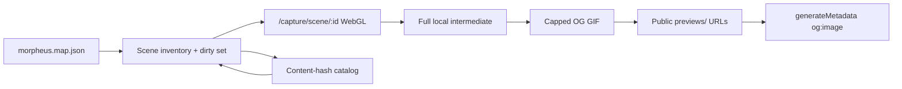

# feat: Scene OG GIF pre-generation

## Summary

Build an offline pipeline that captures every scene via a self-driving WebGL capture page, stores full local intermediates, encodes length-capped OG GIFs, publishes them as public URLs, and wires `og:image` on scene share surfaces. No MCP batch spine; no ffmpeg remapping of packed PAN textures.

## Problem Frame

Share cards and social unfurls need animated, engine-faithful scene previews. Live WebGL at request time is rejected. Empirical work showed packed GameDB PAN files are GPU textures, not safe raw inputs for ffmpeg projection. The player already has presentation readiness, multi-canvas grab, fresh-start gamestate, and cast activation — batch capture should reuse those rather than inventing a second renderer (see origin requirements).

## Requirements

Trace to origin R-IDs:

| Plan focus | Origin |
|------------|--------|
| Full-map corpus, cast-shape pano vs special | R1–R3 |
| Fresh-start active stack; include active TRN casts | R4–R6 |
| WebGL 360° pano; no ffmpeg PAN primary | R7–R8 |
| Special motion + length-capped OG GIF | R9–R10 |
| Self-driving capture; automation collects only | R11–R13 |
| Full intermediate + OG GIF; first frame usable | R14–R17 |
| Per-scene hashes; public stable URLs | R18–R20 |
| Success criteria R21–R24 | R21–R24 |

## Key Technical Decisions

1. **Capture URL: dedicated `/capture/scene/[sceneId]` (dev/batch-oriented)** — Keeps live `/scene/[sceneId]` free of capture side effects; clear “self-driving mode” surface. Query params for policy overrides (`frames`, `format`) allowed.

2. **Motion program lives in the app** — Capture page boots fresh-start gamestate (`fetchInitial` / existing RTK seed), waits for presentation readiness (presentation tokens / committed pano texture — not DOM-only), then either steps yaw for panos or plays special/TRN media long enough for a full local intermediate. External runner only navigates and harvests artifacts.

3. **Pixel grab reuses stage multi-canvas composite** — Same idea as `captureStageFrame` in `packages/www/src/app/scene/stage-shell.tsx`; extract or share a module so dissolve covers and capture both composite WebGL + 2D layers. Require `preserveDrawingBuffer: true` on pano GL (already documented in `packages/www/AGENTS.md`).

4. **Two-tier artifacts** — Per scene: full intermediate (WebM/MP4 or frame sequence under a local/batch output dir) + length-capped animated GIF for OG. Encode knobs versioned so GIF re-encode can skip re-capture when intermediate hash is unchanged (R24).

5. **Public path: `previews/scenes/{sceneId}.gif` (CDN/Blob sibling to GameDB)** — Separate prefix from `GameDB/` keeps authored media distinct from derived previews. Publish with the same stable-path + ETag habits as `packages/www/scripts/upload-gamedb.mjs`. Absolute URL for `og:image` via site origin or `NEXT_PUBLIC_MORPHEUS_GAMEDB_ORIGIN`-style public base if previews share that host.

6. **OG wiring targets share surfaces** — Set `openGraph.images` (and Twitter large image) on `/scene/[sceneId]` and `/render/[scene]` `generateMetadata`. Do not depend on live `OgMetaCanvas` for production OG once GIFs exist; canvas may remain a dev/fallback still path.

7. **Classification** — Pano path iff scene has active `PanoCast` under fresh-start; else special/movie path. Prefer cast-shape over raw `sceneType` (R2).

8. **Default encode caps (planning defaults, tune later)** — OG GIF: max width 640, full 360° pano at ~16–24 frames (~8–12 fps) or equivalent duration budget; specials: max ~3s of motion subsampled into that frame budget; palette encode via ffmpeg after intermediate. Document in recipe version string for hashes.

9. **MCP is out of the batch critical path** — May remain for interactive agent testing; capture must succeed with MCP disconnected (R12, R23).

## High-Level Technical Design

**Capture page (directional):**

1. Boot app shell + `fetchInitial` gamestate only.
2. Load scene; wait until presented (pano texture commit or special compositor ready).
3. If pano: for each yaw step, `setRotation`, composite stage, append frame / record.
4. If special: play active movies through capture window; composite frames.
5. Signal completion (DOM attribute + optional JSON manifest blob download or POST to local collector).
6. Runner encodes GIF from intermediate if not done in-page.

## Scope Boundaries

**In scope**

- Capture page + readiness + export
- Batch runner (headless Chromium) over full map
- Intermediate + GIF encode pipeline
- Per-scene content-hash dirty detection
- Publish previews + wire OG metadata

**Deferred (origin + plan)**

- Scene picker gallery UI
- Live loading chrome previews
- MCP retirement
- Graph edge GIFs (explicitly out — only in-scene TRN casts)

**Deferred to follow-up work**

- Optional gifski if ffmpeg palette quality is insufficient
- Multi-format OG (video cards) beyond GIF requirement

## Implementation Units

### U1. Scene inventory and content-hash manifest

**Goal:** Enumerate all scenes, classify pano vs special under fresh-start activation, compute per-scene input hashes, emit a rebuild plan (dirty set).

**Requirements:** R1–R6, R18–R19

**Dependencies:** None

**Files:**
- Create: `packages/www/scripts/scene-preview-inventory.mjs` (or `.ts` if existing script TS patterns fit)
- Create: `packages/www/scripts/scene-preview-inventory.test.mjs`
- Modify or read: `packages/morpheus/client/js/service/map-query.ts`, `packages/morpheus/client/js/service/gameState.ts`, `packages/morpheus/client/js/morpheus/gamestate/isActive.ts`, map JSON path used by prepare/map-query

**Approach:**
- Load map offline; `getAllSceneIds` or equivalent.
- For each scene, resolve casts, apply `fetchInitial` + `isCastActive` offline (Node port or shared pure functions — prefer pure helpers over browser).
- Classify pano if any active PanoCast.
- Hash inputs: scene id + ordered active cast ids + media path digests (stat/hash GameDB files) + policy version string.
- Write/update manifest JSON (local + optional map-sidecar later).

**Patterns:** `packages/www/mcp-server/map-query.ts` enumeration; `upload-gamedb.mjs` report/ETag style.

**Test scenarios:**
- Happy: fixture map with one pano and one special produces two rows with correct kinds.
- Edge: scene with only gated casts active under empty gates — active set matches `isCastActive` semantics.
- Edge: media file missing → row marked missing, still enumerable.
- Integration: hash changes when a referenced PNG/MP4 changes; unchanged when unrelated file changes.

**Verification:** Dry-run inventory lists ~1844 scenes; sample scene 1010 is pano; dirty set empty on second run without media changes.

---

### U2. Shared stage frame capture helper

**Goal:** Export a reusable multi-canvas stage grab suitable for dissolve and capture sequences.

**Requirements:** R13

**Dependencies:** None (can parallel U1)

**Files:**
- Create: `packages/www/src/morpheus-app/capture/captureStageFrame.ts` (or under `src/utils/`)
- Create: `packages/www/src/morpheus-app/capture/captureStageFrame.test.ts` (jsdom/canvas mock as feasible)
- Modify: `packages/www/src/app/scene/stage-shell.tsx` to import shared helper

**Approach:** Lift logic from private `captureStageFrame`; keep devicePixelRatio and fail-closed black fill. Ensure WebGL canvases with `preserveDrawingBuffer` are readable.

**Patterns:** Existing dissolve cover grab in stage-shell.

**Test scenarios:**
- Happy: mock source with one canvas draws into target with expected size.
- Edge: zero-size source returns false without throw.
- Edge: tainted/failed drawImage leaves black backing (fail-closed).

**Verification:** Dissolve transitions still cover; helper unit tests pass.

---

### U3. Self-driving capture page

**Goal:** `/capture/scene/[sceneId]` loads one scene under fresh-start state, waits for presentation ready, runs pano 360 spin or special motion capture, exports full intermediate (and optionally raw frames).

**Requirements:** R4–R12, R14, R21–R23

**Dependencies:** U2

**Files:**
- Create: `packages/www/src/app/capture/scene/[sceneId]/page.tsx` (and client capture shell)
- Create: `packages/www/src/morpheus-app/capture/CaptureSession.tsx` (or similar)
- Modify: presentation/readiness hooks as needed (`InteractiveStage` / presentation tokens)
- Modify: rotation dispatch via existing RTK `setRotation`
- Tests: `packages/www/src/morpheus-app/capture/CaptureSession.test.tsx` (state machine / ready / export signaling)

**Approach:**
- Minimal chrome; no living-save bootstrap that overrides fresh-start.
- Ready = same criteria as AGENTS presentation readiness.
- Pano: step `yaw3600` across 0..3600 exclusive end, equal steps (default 24); grab after settle frames.
- Special: allow active special/TRN media to advance for full intermediate duration; composite at fixed FPS.
- Completion: set `data-capture-state="done"` (or equivalent) and expose `window` result descriptor (paths/blob URLs/base64 sizes) for the runner.
- Gate route if needed: only enable in development / when `CAPTURE_MODE=1` env is set so production deploy is not an open farm.

**Patterns:** `InteractiveStage` presentation callbacks; `gamestateSlice` initial `fetchInitial`; `setRotation` in rotation slice.

**Test scenarios:**
- Happy: mock ready pano session emits N frames and done state.
- Happy: special path records until duration policy ends.
- Error: scene missing → failed state without hang.
- Edge: ready never fires → timeout failure signal (no infinite runner wait).
- Integration: capture does not call MCP WebSocket.

**Verification:** Manual headless open of scene 1010 capture URL produces intermediate with continuous pano motion; MCP disconnected.

---

### U4. Batch runner and GIF encode

**Goal:** CLI walks dirty set, drives headless Chromium against capture URLs, encodes capped OG GIFs from intermediates, updates manifest.

**Requirements:** R10, R14–R15, R18, R21–R24

**Dependencies:** U1, U3

**Files:**
- Create: `packages/www/scripts/generate-scene-previews.mjs`
- Create: `packages/www/scripts/generate-scene-previews.test.mjs`
- Optional: package.json script on `morpheus-next`
- Local output dirs (gitignored): e.g. `.scene-previews/intermediates/`, `.scene-previews/gif/`

**Approach:**
- Use Playwright or Puppeteer (add as devDependency if missing) against `yarn workspace morpheus-next dev` or a static capture-capable server.
- For each dirty scene: navigate capture URL, wait for done/fail, save intermediate artifacts.
- Encode GIF with ffmpeg palette pipeline from intermediate; apply width/duration caps (KTD 8).
- Write GIF next to intermediate; update hash manifest statuses.
- Concurrency limit; resume support like upload-gamedb.

**Patterns:** `upload-gamedb.mjs` resume/concurrency/report; experimental session captures under `/tmp/morpheus-pano-test` for expected visual baseline.

**Test scenarios:**
- Happy: mock capture page → encode path produces gif file + manifest row complete.
- Edge: capture timeout marks scene failed without aborting entire batch.
- Edge: re-run with unchanged hashes encodes 0 captures.
- Edge: policy-only version bump re-encodes GIF from intermediate without capture (when intermediate present).

**Verification:** Spot-check 1010 GIF full revolution; special sample has motion; second full dry-run is no-op for captures.

---

### U5. Publish previews and wire OG metadata

**Goal:** Public absolute GIF URLs available to crawlers; scene pages declare them in metadata.

**Requirements:** R16–R17, R20, F2

**Dependencies:** U4 (at least sample GIFs + path convention)

**Files:**
- Modify: `packages/www/src/app/scene/[sceneId]/page.tsx` (add `generateMetadata` with images)
- Modify: `packages/www/src/app/render/[scene]/page.tsx` (add `openGraph.images`)
- Create or modify: upload helper for previews (extend `upload-gamedb.mjs` or `upload-scene-previews.mjs`)
- Modify: `packages/www/scripts/gamedb-paths.mjs` only if sharing content-type helpers
- Tests: metadata URL builder unit tests

**Approach:**
- Resolve preview URL: `{PUBLIC_PREVIEWS_ORIGIN}/previews/scenes/{sceneId}.gif` (env-driven).
- `generateMetadata` includes `openGraph.images` and Twitter `summary_large_image` with that URL when GIF is known present (or always point at stable URL and accept 404 until published — prefer manifest check or always publish full corpus first).
- Upload script mirrors GameDB public Blob keys under `previews/scenes/`.

**Patterns:** Existing `generateMetadata` on render page; root `metadataBase` in `layout.tsx`.

**Test scenarios:**
- Happy: metadata for scene 1010 includes absolute gif URL ending in `previews/scenes/1010.gif`.
- Edge: missing origin env falls back safely without throwing.
- Integration: content-type for `.gif` remains `image/gif` in upload path map.

**Verification:** View page source / Next metadata for a scene shows `og:image` pointing at published GIF; social debugger optional.

---

### U6. Operator docs and package scripts

**Goal:** Document how to prepare map/media, run inventory, capture, encode, publish; wire yarn scripts.

**Requirements:** F1, operability

**Dependencies:** U1–U5

**Files:**
- Create or modify: `packages/www/README.md` or short `docs/release/scene-previews.md`
- Modify: `packages/www/package.json` scripts
- Update origin outstanding questions as resolved in plan (no second requirements edit required)

**Approach:** Single runbook: prerequisites (Node 24, GameDB, map, ffmpeg, Chromium), env vars, commands, expected outputs, failure modes.

**Test expectation:** none — documentation only.

**Verification:** Another engineer can follow runbook on a clean machine with media present.

## Risks and Mitigations

| Risk | Mitigation |
|------|------------|
| Headless WebGL black frames | Use presentation-ready gate; `preserveDrawingBuffer`; smoke-test 1010 before full batch |
| 1844 scenes wall-clock | Per-scene dirty set; concurrency; intermediates reuse |
| OG crawlers ignore animation | Ensure strong first frame (R17) |
| Capture route exposed in prod | Env gate / non-production only |
| Hash false negatives | Include policy version + media digests + scene def |

## Open Questions

- Exact concurrency and CI hosting for full-map capture (local-only first is acceptable).
- Whether intermediates live only on operator disk or also in Blob (local-first meets R14).

## Alternatives Considered

| Approach | Why not |
|----------|---------|
| MCP rotate + screenshots | Fragile; user rejected as batch spine |
| ffmpeg on packed PAN | Invalid projection after tests |
| Thin page + external-only rotation | User chose self-driving capture |
| GIF-only without full intermediate | Violates full local render preference |

## Sources and Research

- Origin: `docs/brainstorms/2026-07-22-scene-og-gif-pregeneration-requirements.md`
- Repo patterns: `OgMetaCanvas.tsx`, `stage-shell.tsx` capture, `render/[scene]/page.tsx` metadata, `upload-gamedb.mjs`, `fetchInitial` / `isCastActive`, map-query
- Institutional learnings: thin; map≠live-state convention from hotspot parity doc
- External research: skipped — approach settled in brainstorm; stack patterns local

## System-Wide Impact

- New public media class (`previews/`) and upload path
- Scene share unfurls change from site default image to per-scene GIF
- Batch depends on headless browser + ffmpeg on operator machines
- No production game-control WebSocket dependency
