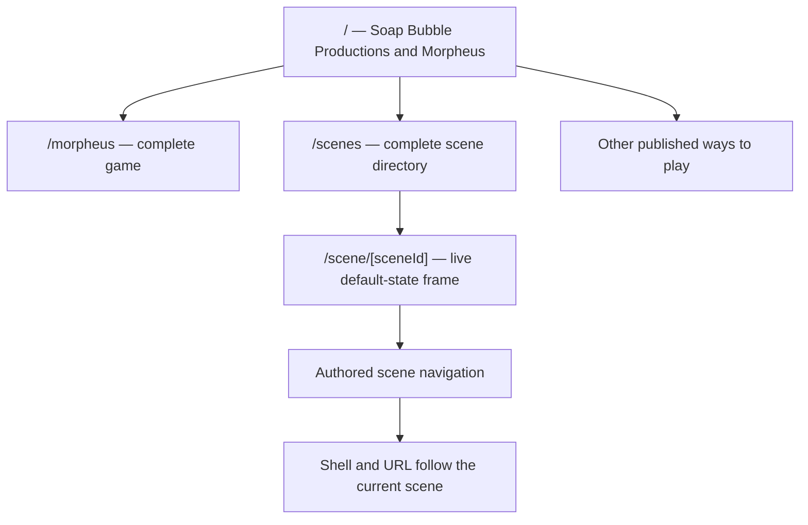
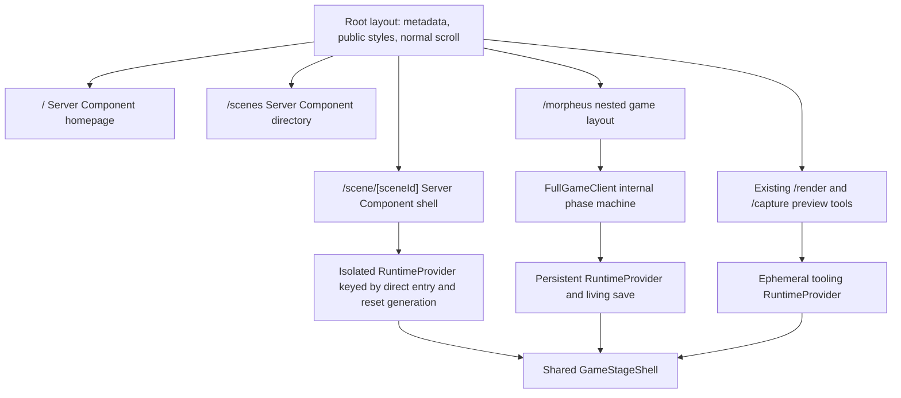
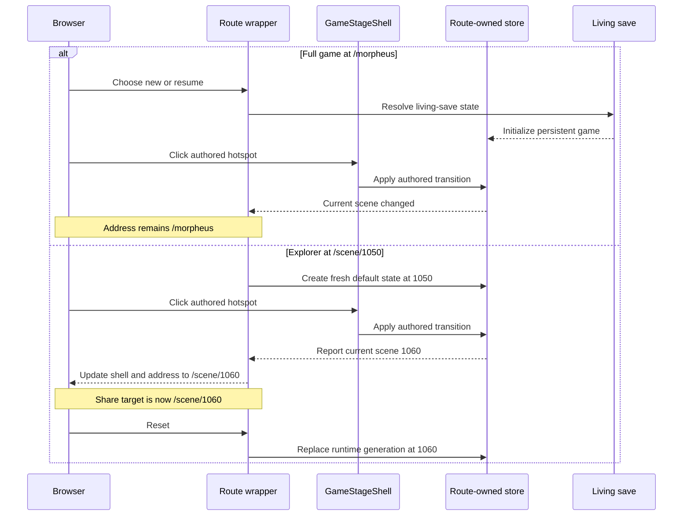
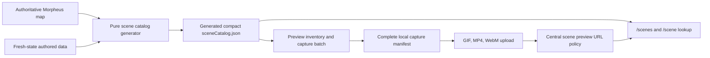

# Soap Bubble Productions and Morpheus Public Site - Plan

## Goal Capsule

- Objective: Establish a public home for Soap Bubble Productions and *Morpheus*: a real homepage at `/`, the complete game at a stable `/morpheus` route, and a scene explorer that makes every authored scene discoverable, shareable, and directly playable.
- Product authority: The project owner's personal restoration and archival intent is authoritative for this vanity release. The authored Morpheus scene map and game behavior are authoritative for scene inventory and play. This plan owns the initial public-site contract; it does not invent a user-growth or conversion mandate.
- Delivery shape: Build a server-first public site around a persistent full game at `/morpheus` and an isolated fresh-state explorer at `/scene/[sceneId]`. Existing local preview tooling remains at `/render/[scene]` and `/capture/scene/[sceneId]`; MCP and its broker are untouched.
- Open blockers: None at the product-contract level. Implementation must complete and publish the entire scene-preview corpus before the directory is release-ready.

---

## Product Contract

### Summary

Create a greenfield Soap Bubble Productions public site with an editorial Web '98 character and a modern, responsive build. The homepage introduces the studio and *Morpheus*, routes visitors toward the web game, scene explorer, and other legitimate ways to play, and leaves room for social channels once they exist. The complete game moves to `/morpheus` and no longer changes the browser URL as scenes change.

The initial scene explorer lives at `/scenes`, lists the complete authored scene inventory, and links to `/scene/[sceneId]`. A scene page immediately starts the selected scene in a contained, playable game frame using fresh default game state. Hotspots and authored transitions remain interactive; as play continues, the surrounding shell and browser address both follow the current scene so any explored scene remains directly linkable. Pre-generated scene media supports discovery, but capture formats, readiness, and failures are not visitor-facing content.

This is intentionally not a reconstruction of the previous website. It is a new presentation informed by the era of the game.

### Problem Frame

The current root experience is game-first: it presents the game's title flow and then routes play through scene URLs. It does not provide a public place to understand Soap Bubble Productions, learn what *Morpheus* is, find other releases, or browse the game's authored scenes. Meanwhile, `/scene/[sceneId]` is coupled to the running game's routing and save/session rules rather than functioning as a durable public information and exploration page.

The desired change is personal and archival, not a response to an existing user funnel. Success means the project finally has the public home its owner wants, preserves a complete playable game, and exposes the game's unusual scene corpus as something worth exploring in its own right.

### Key Decisions

1. PD1 — Editorial Web '98 is the visual direction. This was chosen over a cinematic CD-ROM portal and a neon/midnight shrine because those alternatives read as too modern. The selected direction should evoke a carefully made late-1990s editorial website without inheriting period usability problems. `session-settled: user-directed`. Governs R2-R5.
2. PD2 — The site is greenfield, not a legacy-site recreation. Historical-site archaeology was explicitly stopped; the old site is not a design or content-parity target. `session-settled: user-directed`. Governs R1-R3.
3. PD3 — Scene detail is live exploration, not a preview-first archive. A pre-generated loop with a separate “load live” action was rejected. The selected scene should be playable immediately so the same surface works for exploration and debugging. `session-settled: user-directed`. Governs R12-R16.
4. PD4 — Preview generation is production work, not public taxonomy. Visitor-facing GIF labels, readiness filters, “preview ready” messaging, and failure-oriented UI were rejected. The release should be built toward a complete preview corpus. `session-settled: user-directed`. Governs R9-R11 and R15.
5. PD5 — The scene explorer URL follows the currently displayed scene. Authored navigation updates both the shell's current-scene display and the browser address to `/scene/[currentSceneId]` without restarting the live runtime. Share targets the current scene, while `/morpheus` alone remains URL-stable during play. `session-settled: user-directed`. Governs R13-R14.
6. PD6 — Authentication belongs to the later operator workflow. There are no public user accounts. A private, authenticated bug-report administration surface is desired later, but it is not part of the initial public-site release. `session-settled: user-directed`. Governs Scope Boundaries.

### Requirements

#### Public homepage

- R1. `/` must be a genuine public homepage. It must not automatically start or route the visitor into the game.
- R2. The homepage must follow the approved editorial Web '98 direction: period-aware typography, rules, panels, index-like navigation, and restrained ornament, delivered with modern responsive layout, readable hierarchy, keyboard usability, and accessible contrast.
- R3. Homepage copy must ground Soap Bubble Productions and *Morpheus* in verifiable history rather than invented nostalgia. It should explain the project's family-and-friends origins, its long production, the original 1998 release, the icebound Herculania mystery, and the restored playable edition at an appropriate editorial depth.
- R4. The homepage must provide clear paths to play on the web, open the scene explorer, and find other currently valid ways to play. itch.io and TestFlight may be shown only when the corresponding destination is real and supplied for publication.
- R5. Social destinations must not be fabricated or represented by dead icon links. The design may reserve an editorial area for future channels, but actual links appear only when supplied.

#### Full game

- R6. The complete normal game must be available at `/morpheus`.
- R7. Scene changes during full-game play must remain internal to the game experience; they must not rewrite `/morpheus` in the browser address bar.
- R8. Moving the game must preserve its normal title/start flow, save behavior, authored hotspots, scene transitions, menus, media, and supported input behavior.

#### Scene explorer

- R9. `/scenes` must list every scene ID in the authoritative authored scene inventory. The directory must not hide scenes behind capture-readiness filters.
- R10. Each directory entry must link to `/scene/[sceneId]`, include an identifying scene visual, and distinguish at least panorama scenes from special scenes using authoring data or deterministic static analysis.
- R11. More specific labels such as transition movie or 2D puzzle may replace the broad special-scene label when that subtype is confidently derivable. Unverified world or region names must not be inferred merely to make the directory feel richer.
- R12. A valid `/scene/[sceneId]` visit must immediately start that scene in a contained, playable game frame using a fresh default game state. It must not require an existing save or a separate “load live” action.
- R13. The scene frame must support the scene's authored interactions, including rotation where applicable, hotspot clicks, puzzles, and transitions to other scenes. As play moves, the surrounding shell and browser address must update to the current scene without restarting the live runtime.
- R14. Internal navigation from a scene page must replace the browser URL with `/scene/[currentSceneId]`. A share action must share the current-scene route, a direct request for that route must identify and visually represent that scene in page metadata, and Reset must recreate fresh default state at the current scene.
- R15. The public explorer must not show implementation details such as GIF/MP4 format tags, “pre-generated loop,” preview readiness, capture failures, preview detail fields, or printed route/permalink text. At release, every listed scene must have a useful published directory visual. Lazy browser rendering of a missing asset is runtime resilience only and does not satisfy the release gate.
- R16. The explorer shell should be useful for both casual discovery and developer debugging without exposing local-only control infrastructure or turning the page into an engineering dashboard.

### Key Flows

1. **Learn and choose:** A visitor lands on `/`, learns what Soap Bubble Productions and *Morpheus* are, and chooses the full web game, scene explorer, or another published way to play.
2. **Play the complete game:** A visitor opens `/morpheus`, follows the normal title/start flow, loads or begins a game, and moves through scenes while the browser remains at `/morpheus`.
3. **Browse scenes:** A visitor opens `/scenes`, scans the complete scene inventory by visual and trustworthy type, and selects any scene ID.
4. **Explore from a scene:** `/scene/[sceneId]` starts the chosen scene in default state. The visitor rotates, clicks, solves, or follows transitions; the shell and browser address follow the current scene without interrupting play.
5. **Share or reset:** From a scene page, the visitor can share the current-scene URL or reset that current scene to fresh default state.

### Acceptance Examples

- AE1 — Homepage instead of game bootstrap
  - Given a visitor opens `/`
  - When the page becomes interactive
  - Then the visitor sees the Soap Bubble Productions/*Morpheus* homepage and can choose where to go
  - And no game scene starts or route change occurs without their action.

- AE2 — Stable full-game route
  - Given a player starts the complete game at `/morpheus`
  - When an authored interaction moves the game from one scene to another
  - Then the new scene is playable
  - And the browser address remains `/morpheus`.

- AE3 — Direct default-state scene start
  - Given scene ID `1050` exists in the authored map
  - When a visitor opens `/scene/1050` without a save
  - Then scene `1050` starts immediately in fresh default game state
  - And its authored interactions are available in the frame.

- AE4 — Explore with a linkable current scene
  - Given a visitor started at `/scene/1050`
  - When a hotspot transitions the frame to scene `1060`
  - Then the shell identifies `1060` as the current scene
  - And the browser address becomes `/scene/1060` without restarting the runtime
  - And Share produces the `/scene/1060` link.

- AE5 — Honest scene classification
  - Given the directory can prove a special scene is a transition movie from authored data
  - When that scene is listed
  - Then it may be labeled “transition movie”
  - But a special scene with no confident subtype remains labeled “special” rather than receiving a guessed puzzle or world label.

- AE6 — Success-first preview presentation
  - Given the public scene directory is release-ready
  - When a visitor browses all scenes
  - Then every entry has a useful visual
  - And the page contains no preview-ready filter, capture status, or media-format badge.

- AE7 — Unavailable external channel
  - Given a TestFlight or social destination has not been supplied for publication
  - When the homepage renders
  - Then it does not present a dead or fabricated link for that channel.

### Success Criteria

- A first-time visitor can understand the relationship between Soap Bubble Productions and *Morpheus* before entering the game.
- The homepage visibly reflects the approved editorial Web '98 direction on both desktop and mobile without reverting to the rejected cinematic-portal or neon-shrine treatments.
- The full game remains playable end to end from `/morpheus`, and normal scene changes do not change that URL.
- Every authored scene is discoverable in `/scenes` and directly starts in fresh default state from its own `/scene/[sceneId]` page.
- Scene-page navigation updates both the shell and browser URL to the current scene without restarting the runtime.
- The directory ships with a useful visual for every listed scene and no visitor-facing preview-status concepts.
- Public copy and outbound links are sourced, accurate, and do not imply unavailable platforms or social channels.

### Scope Boundaries

#### Included in this release

- Public homepage and approved visual/content direction.
- Stable full-game route at `/morpheus`.
- Complete scene directory at `/scenes`.
- Linkable, live, default-state scene pages at `/scene/[sceneId]`.
- Accurate scene-type classification where deterministically available.
- Share and reset actions for the scene explorer.
- Completion and use of scene visuals needed for the public directory.

#### Deferred surrounding work

- Authenticated operator area and bug-report collection workflow.
- Public user accounts, profiles, or account-linked game state.
- Actual social-channel links until destinations are supplied.
- A curated region/dream-world taxonomy such as Deck 1 or Oasis unless a trustworthy mapping is established.
- Rich editorial notes, walkthroughs, or hand-curated descriptions for every scene.

#### Outside the product identity

- Faithful reconstruction of the previous Soap Bubble website.
- Growth-funnel, conversion, or community-platform requirements unsupported by the owner's stated vanity/archival goal.
- Public exposure of capture-pipeline state or internal debugging infrastructure.
- Changes to MCP, its browser client, its broker, its paths, or its test workflow.

### Dependencies and Assumptions

- The authored Morpheus map remains the source of truth for scene membership. Repository inspection found 1,843 scenes at the time of this brainstorm; the product requirement follows the authoritative inventory rather than freezing that count in UI copy.
- The existing preview pipeline provides stable GIF, MP4, and WebM scene outputs and can resume or regenerate work. Its current local manifest is incomplete, so completing the release corpus is required before the public directory meets R15.
- The current direct scene route does not yet provide the public fresh/default-state startup described by R12; planning must explicitly separate this explorer behavior from current save rules.
- Existing authored data already distinguishes panorama and special scenes and exposes some movie-specific information. More detailed public labels must be derived only where evidence is reliable.
- itch.io is an established current destination. TestFlight and social destinations are content dependencies controlled by the project owner and should appear only when publication-ready.
- The existing scene preview URLs and social metadata are useful inputs, but the route and presentation changes must follow this new public-site contract.

### Planning Resolutions

- The public routes, homepage direction, scene-page interaction model, URL behavior, and v1 boundary are settled.
- Trustworthy scene labels come from one generated compact catalog derived from the authoritative map and fresh state. Broad panorama/special classification is required; narrower labels are emitted only by deterministic authored signals. See KTD5.
- Preview completion is a release gate. Rerun the existing resumable batch against the authoritative inventory with a healthy local server, investigate only reproducible residual failures, and publish one GIF, MP4, and WebM per scene. See KTD7.
- The renderer and interaction core are shared, while each route supplies an explicit runtime policy and owns its store lifetime. The full game retains saves, menus, and checkpoints; explorer pages receive a fresh isolated store and exclude persistence. See KTD2 and KTD3.

### Sources and Research

#### Project sources

- `packages/www/AGENTS.md` — current and intended route contract.
- `packages/www/src/app/client.tsx` — current root title flow and initial scene navigation.
- `packages/www/src/app/scene/stage-shell.tsx` — current game shell, save handling, URL mutation, and authored interaction integration.
- `packages/www/src/morpheus-app/storage/livingSaveIdentity.ts` and `packages/www/src/morpheus-app/store/livingSaveCoordinator.ts` — current initial scene and save-governed startup behavior.
- `packages/www/src/lib/scenePreviewUrl.ts` — stable preview-media paths and social metadata inputs.
- `packages/www/scripts/generate-scene-previews.mjs`, `packages/www/scripts/scene-preview-inventory.mjs`, and `packages/www/.scene-previews/manifest.json` — current resumable capture workflow and corpus state.
- `docs/plans/2026-07-22-001-feat-scene-og-gif-pregeneration-plan.md` and `docs/release/scene-previews.md` — prior preview-generation and release contracts.

#### External grounding

- [Introduction — Soap Bubble Productions on itch.io](https://soapbubble.itch.io/morpheus/devlog/12728/introduction) — first-party project origin, production, original release, and restoration account.
- [Morpheus on itch.io](https://soapbubble.itch.io/morpheus) — current public game destination.
- [Morpheus — MobyGames](https://www.mobygames.com/game/4669/morpheus/) — independent release and game overview.
- [Morpheus review — Adventure Classic Gaming](https://www.adventureclassicgaming.com/index.php/site/reviews/450/) — independent setting, story, and play-format context.

---

## Planning Contract

Product Contract preservation note: restructured, no scope change. The three planning questions were resolved into KTD2, KTD3, KTD5, and KTD7, and settled annotations were normalized into stable decision IDs.

### Technical Context

- The Next.js app currently places the game provider in the root layout, so living-save bootstrap, route-to-scene matching, and viewport assumptions apply to every route. That is incompatible with a scrollable public homepage and isolated scene explorer.
- The current root client owns the title screen and routes into `/scene/2000`. The current stage shell owns game transitions, save/checkpoint behavior, menus, responsive sizing, and every `router.push('/scene/...')` scene mutation.
- The authored map currently contains 1,843 scenes. The inventory generator already knows how to enumerate them and create fresh-state visuals, while `scenePreviewUrl` centralizes the published media paths.
- The current local preview manifest records 798 successful captures and 1,045 failures. All recorded failures are special scenes; 1,005 were connection refusals, 39 were presentation timeouts, and one was a Playwright wait timeout. This evidence calls for a healthy-server rerun before changing capture logic.
- Local preview output currently contains 798 files in each of GIF, MP4, and WebM form, and the upload report records 2,394 uploaded objects. Release completeness is 1,843 of each format, or 5,529 uploaded objects, with zero failed scene rows.
- MCP and its local broker are existing development infrastructure outside this plan. Their routes, clients, server behavior, documentation, and tests remain untouched.

### Key Technical Decisions

#### KTD1 — Use physical App Router nesting for the game surface

The public routes are `/`, `/scenes`, and `/scene/[sceneId]`. The complete game moves physically to `/morpheus`. Existing local preview tooling remains at `/render/[scene]` and `/capture/scene/[sceneId]`, and the existing MCP/broker routes remain unchanged.

This uses ordinary App Router route ownership and one root layout. It does not use `basePath`, edge rewrites, compatibility redirects, or a second root layout. Root `/scene/[sceneId]` is repurposed as the explorer and is not redirected. Local capture/render and MCP routes are not part of the public route migration.

Rationale: physical ownership makes the public site and full game inspectable without perturbing established local preview or MCP machinery.

Alternatives rejected:

- Next.js `basePath`, because it would prefix the whole app and affect public assets and routes instead of isolating only the game.
- Edge rewrites, because they would conceal ownership and leave source paths and runtime assumptions split.
- Compatibility redirects for the old root game entry, because every affected public consumer is in this repository and the project explicitly does not preserve obsolete public paths.

Governs R1, R6-R8, R12, and KTD2.

#### KTD2 — Give every route family an explicit runtime owner and store lifetime

The root layout becomes a server-first public shell with normal document scrolling and no game provider. Runtime ownership is then explicit:

| Route family | Store lifetime | Initial state | Persistence | Layout behavior |
| --- | --- | --- | --- | --- |
| `/` and `/scenes` | None | Not applicable | None | Public document scroll |
| `/morpheus` | Persistent for the page session | Title/save hub, then chosen game | Living save and checkpoints | Full viewport game |
| `/scene/[sceneId]` | New store per direct entry and reset generation | Fresh default state at the route scene | None | Contained 640:400 stage in a scrollable page |
| `/render/[scene]` and `/capture/scene/[sceneId]` | Ephemeral per render/capture | Fresh deterministic state | None | Existing tool-owned viewport |

`/morpheus/layout.tsx` is a styling and viewport boundary only. The persistent provider mounts in the `/morpheus` page client. Because the root provider is removed for the public site, the existing render and capture entries mount their own ephemeral providers without changing their URLs or external workflow. Loading a tool route therefore never constructs a living-save coordinator or performs a storage read or write.

The runtime policy must be a typed value supplied by route wrappers, not inferred from `pathname` inside the game core. Every provider constructs the checkpoint coordinator against its own `AppStore`; the module-level singleton coordinator path is removed. A direct document navigation to another scene route, or invoking Reset at the current scene, keys and remounts the entire isolated runtime subtree rather than replacing Redux alone. An authored in-frame transition updates the current-scene URL without remounting that live runtime. Each runtime instance owns and disposes its store, checkpoint queue, presentation waits, transition promises, animation frames, media, and timers. Deferred work carries a runtime generation or presentation token and cannot commit into a replacement runtime.

Fresh explorer state preserves authored automatic scene-entry actions by using the existing fresh-state path with `skipSceneEntryActions: false`. It never consults living-save storage or creates checkpoints.

Rationale: the store boundary is the reliable boundary for persistence and transient game state. Clearing only the scene slice would leave other reducers, media, and component lifecycle state behind.

Alternative rejected: a single global store with route-conditioned effects, because it makes isolation depend on every present and future effect remembering the route and leaves save data observable from public pages.

Governs R1, R8, R12-R14, and R16.

#### KTD3 — Share the game stage through typed capabilities, not duplicated shells

Refactor the current stage shell into a route-neutral `GameStageShell` and thin route wrappers. The stage accepts a runtime policy and callbacks for scene-change reporting while preserving the authored renderer, hotspot, puzzle, media, input, and transition paths.

The full-game host enables living-save bootstrap, checkpoints, save-aware menus, and return-to-title. The explorer host exposes current-scene reporting and reset but excludes persistence, save menus, and checkpoints. Capture/render use deterministic tooling hosts at their existing routes.

The route-neutral stage core must not import Next navigation, living-save storage, the save coordinator, save menus, or checkpoint singletons. Full-game, explorer, and tooling hosts inject only the capabilities they own. The living-save coordinator returns new/resume/return outcomes to the `/morpheus` phase owner instead of navigating itself.

Scene transition code updates Redux and invokes the route wrapper's current-scene callback. It does not own browser navigation itself. The explorer wrapper uses that callback to update shell text and replace the browser address with `/scene/[currentSceneId]` without remounting the runtime; `/morpheus` ignores scene-route updates and remains stable.

Rationale: one interaction core is necessary for authored behavior parity, while explicit capabilities keep full-game concerns out of the public explorer.

Alternatives rejected:

- Separate full-game and explorer stage implementations, because hotspot, media, puzzle, and transition behavior would drift.
- Boolean flags scattered across the stage, because an explicit runtime-policy type is easier to review and makes unsupported capability combinations unrepresentable.

Governs R7-R8 and R12-R16.

#### KTD4 — Model `/morpheus` as an internal phase machine

`/morpheus` owns the complete game flow without using route changes for title, intro, active stage, save selection, or return to title. Use a small explicit phase model with transitions such as `title -> intro -> stage` and `stage -> title`, while the existing living-save coordinator remains authoritative for new/resume choices and checkpoint data.

A fresh visit begins at the title/save hub. Leaving an explorer page and later opening `/morpheus` does not import the explorer's volatile state. Returning to title inside the full game does not navigate away from `/morpheus`.

Rationale: an explicit phase model replaces the routing responsibility that currently splits title and stage, and it can be tested independently of rendering.

Alternative rejected: query-string or child-route phases, because the product contract requires a stable game URL and gains nothing from publishing internal UI phases.

Governs R6-R8 and AE2.

#### KTD5 — Generate one compact, shared scene catalog from authored data

Add a pure catalog generator that consumes the authoritative scene map and fresh-state data and emits a committed compact JSON artifact for public pages and preview tooling. Each row contains the numeric scene ID, authored scene type, broad public type (`panorama` or `special`), and an optional deterministic subtype. It does not include the full scene payload or inferred world names.

The explicit authoring command runs catalog generation after the engine map preflight restores the map and writes the committed artifact. It records a schema revision and source-map digest. Normal build and preview inventory run check mode: they validate byte-equivalence and digest and fail on drift rather than silently rewriting the catalog. A typed Node/ESM-safe reader with no Next-only dependencies provides ordering, lookup, and filter primitives. `/scenes`, `/scene/[sceneId]`, and preview inventory use this catalog as their membership authority.

Subtype rules are additive and evidence-driven. A rule is accepted only when a unit test names the authored signal and proves representative positive and negative cases. Unclassified special scenes remain `special`.

Rationale: a small generated artifact gives public Server Components and preview tooling a common, reviewable truth without shipping the full authored map or 1,843 complete scene definitions to browsers.

Alternatives rejected:

- Reading the local preview manifest as the directory inventory, because capture success is not scene authorship.
- Hand-maintaining world or subtype maps, because they would immediately become a second, speculative taxonomy.
- Shipping the full game map to the directory client, because the page needs only compact identity and classification fields.

Governs R9-R11, R15-R16, AE5, and agent parity.

#### KTD6 — Render the complete directory server-first and activate media progressively

`/scenes` renders a link and card markup for every catalog row in numeric order on the server, so the complete inventory is present in HTML and discoverable without client-side fetch orchestration. A single directory-level client controller owns search, deterministic type filters, and bounded media activation. It receives only a compact filter index; it does not import the catalog, authored map, game runtime, or per-card Client Components, and it does not install per-card hooks, listeners, or observers.

Cards reserve a stable visual aspect ratio, use the existing centralized preview URL policy, and use `content-visibility: auto` with a measured intrinsic size where browser support permits. Preview playback uses MP4/WebM under one bounded activation controller: the controller attaches sources only around the viewport or keyboard focus, pauses and detaches them when they leave the activation window, and never autoplays when reduced motion is requested. The initial shell may be non-animated until its source is activated. The page must not instantiate 1,843 active videos, canvases, observers, or game runtimes.

Production browser verification uses the authoritative catalog at desktop and narrow-mobile sizes. It confirms that every scene link is present in server-rendered HTML, no engine/runtime chunk or GameDB asset loads, off-window previews do not request media, active media remains bounded as visitors traverse and filter the directory, and the interface remains responsive. These are behavioral requirements, not speculative numeric budgets.

The public directory has no readiness filter, missing-preview badge, error taxonomy, or fallback product state. Complete media is a release gate under KTD7.

Rationale: server-rendered identity and links satisfy completeness and sharing, while progressive media keeps a very large visual index usable.

Alternative rejected: eager autoplay previews, because thousands of decoders, network requests, and active animations would make the directory inaccessible and unstable.

Governs R9-R11, R15, AE5, and AE6.

#### KTD7 — Treat preview completion as a resumable production gate

Keep the existing capture page at `/capture/scene/[sceneId]` and reuse its established generator and release workflow. Before the full batch, harden resume semantics only where current machinery does not already satisfy the contract: a clean row requires matching source digest, catalog/schema and capture-policy revisions, `status: ok`, and three present, nonempty, validated outputs. Failed, partial, corrupt, missing-format, or stale rows remain dirty. Results checkpoint atomically after each scene, merge cumulatively with prior successes, survive interruption, and exit nonzero whenever catalog/results/files are not equal.

Run a representative pilot spanning panorama, special, and previously timed-out scenes. Record p50/p95 capture-and-encode duration, peak RSS, intermediate/output bytes, and failure classes; derive projected wall time and disk usage and require at least 25 percent disk headroom before the corpus run. Use bounded transient retries and stop the batch after three consecutive transport failures or a failed capture-route readiness probe while preserving every completed checkpoint.

Then rerun the resumable capture batch against all catalog rows with a verified healthy local server. Upload and availability verification use bounded concurrency, honor `Retry-After`, resume from recorded results, and validate content type, nonzero length, and checksum or ETag evidence.

Because 1,005 of 1,045 recorded failures are connection refusals, do not interpret the existing manifest as evidence of scene-specific renderer defects. After the clean rerun, reproduce and fix only remaining deterministic capture failures. Upload all three formats and verify catalog-to-manifest-to-upload set equality.

Release evidence must show:

- Catalog scene count: 1,843 unless the authoritative map intentionally changes during implementation.
- Successful capture rows: one per catalog scene.
- Failed capture rows: zero.
- Local outputs: 1,843 GIF, 1,843 MP4, and 1,843 WebM files.
- Uploaded objects: 5,529, with every expected public URL available.

The numeric counts are verification expectations from the current map, not hard-coded visitor-facing copy. If the authored count changes, regenerate the catalog and derive all expected counts from it.

Governs R10, R15, AE6, and release readiness.

#### KTD8 — Verify browser-authored behavior at the real interaction boundary

Pure state, catalog, classification, route-contract, and phase logic use the repository's current unit-test stack. Browser acceptance uses the installed Playwright library through a focused verification script rather than adding a second test runner.

For interaction parity, a real browser click on an enabled hotspot is the source of truth. Direct scene loading or static map lookup does not prove that an authored interaction occurred. The full-game acceptance flow opens `/morpheus`, performs an actual browser-observed hotspot click, and verifies the in-game scene changes while the URL remains `/morpheus`.

The explorer acceptance flow independently opens `/scene/1050`, performs a real browser interaction to scene `1060`, verifies the shell and address both become `/scene/1060` without a runtime restart, and verifies Share targets `1060` and Reset recreates fresh state at `1060`.

Governs AE2-AE4 and R16.

### High-Level Technical Design

#### Route and component topology

#### Runtime behavior matrix

| Behavior | Full game | Scene explorer | Capture/render |
| --- | --- | --- | --- |
| Fresh default state | New-game path only | On direct entry and Reset | Always, deterministic |
| Living-save read/write | Yes | No | No |
| Checkpoints | Yes | No | No |
| Title/save/menu flow | Yes | No | No |
| Browser URL on scene transition | `/morpheus` unchanged | Replace with current `/scene/[id]` without remounting | Tool URL unchanged |
| Scene-change notification | Internal game UI | Update surrounding current-scene label | Capture observer |
| Reset meaning | Existing full-game behavior | Recreate default state at current scene | Recreate deterministic tool state |

#### Full-game and explorer transition sequence

#### Catalog and preview data flow

### System-Wide Impact

- Routing and metadata: the root layout becomes public and scrollable; game-only overflow and viewport rules move under `/morpheus`; a direct scene request generates route-scene-specific canonical, title, description, and Open Graph metadata on the server, while authored in-frame navigation updates the current scene URL in the browser.
- State and persistence: living-save bootstrap leaves the root provider; each route supplies a runtime policy and owns a fresh or persistent store; explorer and tool stores cannot read or write saves.
- Rendering and performance: the directory exposes all scene links in server HTML while media activation is progressive; the game remains client-rendered inside its explicit runtime boundaries.
- Local development and agents: MCP, its browser client, broker, paths, and tests remain unchanged and outside this release.
- Deployment and media: `/morpheus-assets`, `NEXT_PUBLIC_MORPHEUS_GAMEDB_ORIGIN`, `/render/[scene]`, and `/capture/scene/[sceneId]` remain unchanged; preview completeness becomes a release check rather than product UI.
- Accessibility: public pages use landmark structure, real links and buttons, visible focus, keyboard-reachable controls, mobile collapse without horizontal overflow, restrained animation, and `prefers-reduced-motion`; the embedded game must not create a keyboard trap.
- Security and privacy: no auth, user accounts, report submission, or new public control endpoint is introduced.

### Failure and Edge Contracts

- An invalid, non-positive, unsafe, or unknown scene ID resolves to the scene route's not-found experience with a route back to `/scenes`; it never silently substitutes a different scene.
- If fresh game-state initialization fails, the scene page keeps the public shell and presents a bounded retry plus a path back to the directory. It does not fall through to a saved state.
- If an authored transition fails, keep the last valid scene visible, report a restrained in-frame error, and allow retry or explorer reset. Do not rewrite the browser route as recovery.
- Reset requires no confirmation because the explorer has no persistent data. It fully replaces the volatile runtime generation.
- Share opens the native Web Share dialog when available and falls back to copying the current-scene URL only when Web Share is unavailable. Clipboard success or a genuine failure is reported through the size-stable Share button itself; no additional feedback text may reflow the shell. User cancellation is neutral.
- Catalog generation fails the build when the authoritative map is absent, IDs are duplicated, or a required broad type cannot be derived.
- Missing previews fail release verification. They do not create visitor-facing readiness filters, badges, or a permanent fallback product path.

### Implementation Sequence

Implement U1 first so every subsequent public route and preview operation uses the same inventory. U2 is additive: it introduces store factories, injected coordinators, and runtime policies while the current route adapter still works. U1 and U2 must typecheck, build, and smoke the current root game plus `/scene/1050`. U3 performs one atomic public-route cutover that creates `/morpheus`, installs a minimal final isolated owner for `/scene/[sceneId]`, removes the global provider, and only then deletes the obsolete root game entry. Existing capture/render and MCP routes remain untouched. U4 and U5 build the homepage and directory; U6 completes the scene page's editorial explorer shell on the owner established in U3. U7 completes the corpus and performs full browser acceptance. U3 and every later unit must typecheck, build, and smoke `/morpheus` plus `/scene/1050`; the sequence never trades a working product for an unfinished intermediate state.

---

## Implementation Units

### U1 — Establish the generated scene catalog

Goal: Create one compact, deterministic scene-inventory artifact consumed by public pages and preview tooling.

Requirements: R9-R11, R15, AE5, and KTD5.

Dependencies: None.

Files:

- `packages/www/scripts/scene-catalog.mjs` — add the pure generator and classification rules.
- `packages/www/scripts/generate-scene-catalog.mjs` — add the executable generator and fail-fast validation.
- `packages/www/scripts/scene-catalog.test.mjs` — add catalog membership, ordering, duplicate, and classification tests.
- `packages/www/scripts/scene-preview-inventory.mjs` — consume the shared catalog instead of maintaining independent enumeration.
- `packages/www/scripts/scene-preview-inventory.test.mjs` — prove inventory/catalog set equality and broad-type preservation.
- `packages/www/src/generated/sceneCatalog.json` — commit the generated compact artifact.
- `packages/www/src/lib/sceneCatalog.ts` — add typed server-side lookup, ordering, and filter helpers.
- `packages/www/src/lib/sceneCatalog.test.ts` — add lookup and filter tests.
- `packages/www/package.json` — expose explicit catalog write/check scripts and order the check after engine map preparation for direct workspace builds.

Approach:

1. Extract the authoritative enumeration and fresh-state classification logic from the existing preview inventory into a side-effect-free generator.
2. Define a strict compact row schema with `sceneId`, authored `sceneType`, broad public type, and optional proven subtype.
3. Add explicit write and check modes. Write mode records the source digest/schema revision and updates the committed artifact; check mode fails on stale bytes or digest and is used by builds and preview inventory.
4. Ensure direct workspace build/check commands first run the engine's map preparation, then catalog check, rather than relying only on the root Vercel build sequence.
5. Replace preview inventory enumeration with the shared catalog and assert exact set equality.
6. Document every narrower subtype rule beside representative positive and negative tests; leave uncertain scenes broad.

Patterns to follow:

- Follow `packages/www/scripts/scene-preview-inventory.mjs` for map loading and deterministic fresh-state inspection.
- Keep the JSON artifact compact and never import the full map into directory Client Components.

Test scenarios:

1. Generate the catalog twice from identical inputs and assert byte-stable numeric ordering and unique IDs.
2. Assert the generated catalog contains every authoritative map scene and no extra rows.
3. Assert panorama and special classification against known representatives and reject unknown authored types.
4. Assert each optional subtype rule against both matching and non-matching authored signals. Covers AE5.
5. Assert preview inventory IDs exactly equal catalog IDs regardless of current capture state. Covers R9 and R15.
6. Mutate the generated artifact or source digest in fixtures and assert build check and preview inventory fail rather than rewriting it.
7. Regenerate from unchanged source and assert the committed JSON remains byte-identical.

Verification outcome: One generated catalog is authoritative for public membership and preview production, and no consumer invents scene classification.

### U2 — Introduce route-scoped runtime policies and isolated stores

Goal: Separate persistent full-game state from fresh explorer and tooling state before changing public routes.

Requirements: R1, R8, R12-R14, R16, AE1, AE3-AE4, KTD2, and KTD3.

Dependencies: None required; the overall implementation sequence still establishes the shared catalog first.

Files:

- `packages/www/src/morpheus-app/runtime/runtimePolicy.ts` — add the discriminated runtime modes and capability contracts.
- `packages/www/src/morpheus-app/runtime/RuntimeProvider.tsx` — add route-owned store construction and lifecycle.
- `packages/www/src/morpheus-app/runtime/volatileSceneRuntime.ts` — add fresh default-state creation for explorer and tool modes.
- `packages/www/src/morpheus-app/runtime/volatileSceneRuntime.test.ts` — prove isolation, reset, and authored scene-entry behavior.
- `packages/www/src/morpheus-app/store/store.ts` — expose safe store factories without global singleton assumptions.
- `packages/www/src/morpheus-app/store/livingSaveCoordinator.ts` — keep persistence explicitly full-game-only.
- `packages/www/src/morpheus-app/store/livingSaveCoordinator.test.ts` — assert full-game resume/new behavior remains intact.
- `packages/www/src/morpheus-app/store/livingSaveCheckpoint.ts` — require a persistent runtime capability before checkpoint writes.
- `packages/www/src/morpheus-app/store/livingSaveCheckpoint.test.ts` — prove explorer/tool modes cannot checkpoint.
- `packages/www/src/app/providers.tsx` — retain a temporary compatibility adapter in U2; U3 removes it only after both final route owners exist.

Approach:

1. Define `fullGame`, `explorer`, and `tooling` policies as a discriminated union whose capabilities cannot be mixed accidentally.
2. Expose store factories for living-save initialization and fresh default-state initialization.
3. Build the volatile scene envelope through the current authored initialization path with automatic scene-entry actions enabled.
4. Make `RuntimeProvider` own one store instance and its checkpoint coordinator per route lifetime and accept a generation key that remounts the complete explorer/tool subtree.
5. Remove module-level singleton store/coordinator imports from checkpointing and require the full-game host to inject its own coordinator.
6. Move save and checkpoint calls behind the full-game policy rather than checking a pathname.
7. Keep the current root adapter functional during this enabling unit; root-level route matching and living-save bootstrap are removed only in U3 after `/morpheus` and the minimal final `/scene/[id]` owner both exist.
8. Tag deferred transition/media work with the runtime generation or presentation token and dispose all owned async resources when a runtime is replaced.

Patterns to follow:

- Reuse the existing `fetchInitial` and genesis-state creation path rather than constructing ad hoc scene slices.
- Preserve typed Redux hooks in `packages/www/src/morpheus-app/store/hooks.ts`.
- Treat current living-save coordinator and checkpoint tests as regression contracts.

Test scenarios:

1. Create an explorer runtime for scene 1050 with no browser storage and assert current scene 1050, fresh default game state, and no save read. Covers AE3.
2. Transition the explorer store from scene 1050 to scene 1060, recreate it at the current scene with a new generation, and assert all slices return to fresh scene 1060 state. Covers AE4 Reset.
3. Create runtimes for two direct-entry scene IDs sequentially and assert rotation, timers, transitions, media state, and current scene do not leak.
4. Attempt checkpoint creation under explorer and tooling policies and assert it is rejected by the API/type contract.
5. Create full-game new and resume runtimes and assert existing living-save identity, resume, and checkpoint behavior remains unchanged. Covers R8.
6. Assert automatic scene-entry actions still run for explorer fresh state.
7. Construct two independent runtime stores and coordinators, checkpoint one, and assert the other cannot observe or mutate it.
8. Reset during deferred transition, pending checkpoint, and media presentation fixtures; assert stale work cannot commit into the replacement runtime.

Verification outcome: Public pages can exist without booting the game, explorer state is volatile and complete, and full-game persistence retains its current contract.

### U3 — Move the complete game to `/morpheus`

Goal: Make `/morpheus` the complete stable game route while leaving existing local capture/render and MCP machinery untouched.

Requirements: R6-R8, AE2, KTD1-KTD4, and KTD8.

Dependencies: U2.

Files:

- `packages/www/src/app/layout.tsx` — retain only global metadata, public document styles, and the root server layout.
- `packages/www/src/app/providers.tsx` — remove the temporary global runtime adapter after both route owners mount.
- `packages/www/src/app/morpheus/layout.tsx` — add a styling/viewport boundary only; do not mount persistent runtime here.
- `packages/www/src/app/morpheus/page.tsx` — add the server entry for the complete game.
- `packages/www/src/app/morpheus/client.tsx` — move and refactor the current title client into the full-game phase owner.
- `packages/www/src/app/morpheus/title-screen.module.css` — move game-specific title styling.
- `packages/www/src/app/client.tsx` and `packages/www/src/app/title-screen.module.css` — remove the obsolete root game entry after the move.
- `packages/www/src/morpheus-app/runtime/gamePhase.ts` — add pure phase transitions.
- `packages/www/src/morpheus-app/runtime/gamePhase.test.ts` — cover title, intro, stage, resume, and return-to-title transitions.
- `packages/www/src/morpheus-app/components/GameStageShell.tsx` — move/refactor the current stage shell into the route-neutral shared stage.
- `packages/www/src/app/scene/layout.tsx`, `packages/www/src/app/scene/stage-shell.tsx`, and `packages/www/src/app/scene/[sceneId]/client.tsx` — replace with a minimal final isolated scene owner, then remove the obsolete global-stage files; U6 adds the editorial shell.
- `packages/www/src/app/render/[scene]/page.tsx` and `packages/www/src/app/capture/scene/[sceneId]/**` — retain their existing routes while adapting only provider ownership required by removal of the root game provider.
- `packages/www/README.md`, `packages/www/AGENTS.md`, and root `AGENTS.md` — document the public route change and explicitly record that local preview and MCP routes remain unchanged.

Approach:

1. Create the `/morpheus` nested layout as a styling-only boundary and mount the persistent `RuntimeProvider` in the full-game page client.
2. Replace root-to-scene routing with a pure internal phase owner for title, intro, new/resume stage, and return to title.
3. Refactor the stage into a dependency-clean core and route hosts. Remove navigation from the save coordinator so outcomes flow back to the full-game phase owner.
4. Install a minimal isolated `/scene/[sceneId]` owner using explorer policy before removing the global provider or current scene layout; keep the route playable at the end of the unit.
5. Keep `/render/[scene]` and `/capture/scene/[sceneId]` at their existing paths. Mount their existing tool clients with ephemeral providers only as required to survive removal of the root game provider.
6. Do not edit MCP, its browser hook, custom server, tracked configuration, documentation, tests, or routes.
7. Remove the obsolete root game client, title styles, global provider, and stage layout only after the final `/morpheus` and `/scene/[sceneId]` owners compile and smoke.
8. Use scoped assertions over active public-route source and configuration to prove the root game entry and full-game `/scene/...` URL generation are gone. Do not search or modify preview-tool or MCP paths.

Patterns to follow:

- Preserve the current title UI and intro completion contract before applying homepage design work.
- Preserve browser-authored hotspot behavior; never replace interaction proof with direct scene loading.

Test scenarios:

1. Exercise the pure phase reducer from title through new game and resume, then return to title, with no route mutation. Covers R6-R8.
2. Start a full game, apply an authored scene transition, and assert the Next router is not invoked. Covers AE2.
3. Assert living-save writes and checkpoints continue under full-game policy after multiple scene transitions. Covers R8.
4. Assert existing `/render/[scene]` and `/capture/scene/[sceneId]` workflows still resolve locally and perform zero living-save storage operations.
5. Assert the shared stage has no router import and `/morpheus` generates no full-game `/scene/...` URL.
6. Request the obsolete root game entry against a running built app and assert it now serves the homepage rather than redirecting into play.
7. Use a real browser to click an enabled hotspot, verify the browser-observed scene changes, and verify the address remains `/morpheus`. Covers AE2 and KTD8.

Verification outcome: The complete save-aware game works at one stable URL, the root becomes public, and established local preview/MCP tooling remains at its existing paths.

### U4 — Build the editorial Web '98 homepage

Goal: Replace the game-first root with an accessible, historically grounded public home for Soap Bubble Productions and *Morpheus*.

Requirements: R1-R5, AE1, AE7, PD1-PD2, and KTD1.

Dependencies: U3, so the primary Play action has a finished destination.

Files:

- `packages/www/src/app/page.tsx` — implement the server-rendered homepage and semantic landmarks.
- `packages/www/src/app/home.module.css` — add the editorial Web '98 visual system, responsive composition, focus states, and reduced-motion rules.
- `packages/www/src/lib/publicSiteContent.ts` — centralize sourced public copy and only publication-ready external destinations.
- `packages/www/src/lib/publicSiteContent.test.ts` — prove required destinations and omission of unavailable channels.
- `packages/www/src/app/layout.tsx` — finalize site-level metadata, fonts, body classes, and canonical origin behavior.

Approach:

1. Build a server-rendered editorial composition with masthead, issue-like navigation, studio story, Morpheus feature, ways-to-play index, scene-explorer feature, and a reserved but non-interactive future-socials note when no links exist.
2. Translate the approved 1990s direction into typography, rules, constrained palettes, offset panels, small ornamental details, and index language without marquee text, inaccessible contrast, novelty cursors, or desktop-only layout.
3. Source history claims from the first-party itch.io introduction and corroborating references already recorded in the Product Contract.
4. Link Play on the Web to `/morpheus` and Scene Explorer to `/scenes`.
5. Render itch.io, TestFlight, and social actions only from validated, supplied destinations. Do not render disabled links or placeholder icons.
6. Keep all important content in HTML and keep motion decorative, restrained, and removable through `prefers-reduced-motion`.

Patterns to follow:

- Use Next.js Server Components and ordinary links for public navigation.
- Follow the existing app metadata helpers and centralized public-origin logic.
- Use semantic `header`, `nav`, `main`, `article`/`section`, and `footer` landmarks with a single page heading.

Test scenarios:

1. Render `/` and assert no game provider, canvas, scene load, or automatic navigation occurs. Covers AE1.
2. Assert the Play and Scene Explorer links resolve to `/morpheus` and `/scenes`.
3. Assert every historical claim rendered from structured content has a recorded source note and no unsupported copy is introduced. Covers R3.
4. Omit TestFlight and social destinations from the content model and assert no dead button, disabled icon, or placeholder link renders. Covers AE7.
5. Add a valid destination in a fixture and assert it renders as a real link with an understandable accessible name.
6. Verify desktop and narrow mobile viewports have no horizontal overflow, navigation remains usable, focus is visible, and reduced-motion disables nonessential animation. Covers R2.

Verification outcome: `/` explains the studio and game before any play begins and unmistakably follows the chosen era without sacrificing modern accessibility.

### U5 — Build the complete server-first scene directory

Goal: Make every authored scene discoverable through a fast, honest visual index at `/scenes`.

Requirements: R9-R11, R15, AE5-AE6, KTD5-KTD6.

Dependencies: U1 and the stable public layout from U4.

Files:

- `packages/www/src/app/scenes/page.tsx` — render the complete catalog and directory metadata on the server.
- `packages/www/src/app/scenes/scene-directory-client.tsx` — add only search and deterministic type filtering.
- `packages/www/src/app/scenes/scene-directory.module.css` — add the responsive index/grid, stable media geometry, focus, and containment rules.
- `packages/www/src/app/scenes/sceneDirectoryFilters.ts` — add pure normalized search/filter logic.
- `packages/www/src/app/scenes/sceneDirectoryFilters.test.ts` — cover filter combinations and full-list restoration.
- `packages/www/src/app/scenes/sceneMediaActivation.ts` — add one bounded near-viewport/focus media controller with reduced-motion behavior.
- `packages/www/src/app/scenes/sceneMediaActivation.test.ts` — prove activation caps, detachment, and no cumulative decoder growth.
- `packages/www/src/lib/scenePreviewUrl.ts` — ensure directory media and metadata use the centralized public asset path.
- `packages/www/src/lib/scenePreviewUrl.test.ts` — cover every supported preview URL form without leaking readiness state.

Approach:

1. Read the catalog in the Server Component and emit a semantic link/card for every row in numeric order.
2. Include scene ID, broad or proven subtype label, and one useful preview visual; omit media-format, readiness, generated-loop, and route text.
3. Keep catalog reading and card markup server-owned. Give one client controller only the compact search/type index and DOM identifiers it needs; do not pass all card markup through client props or import game/catalog modules into that boundary.
4. Reserve media dimensions and apply content containment so off-screen rows do minimal layout work.
5. Use the bounded media controller to attach MP4/WebM sources only near the viewport or focus, pause and detach them outside the activation window, and keep reduced-motion previews paused on a stable first frame.
6. Keep the full set in the initial server output; filtering changes visibility in the client and never fetches hidden catalog pages. When no rows match, show “No matching scenes” with a Clear Filters action.
7. Link every card to `/scene/[sceneId]` using a normal anchor/Next Link.

Patterns to follow:

- Reuse `scenePreviewUrl` instead of embedding storage origins in components.
- Keep filter functions pure and independent of DOM state.
- Prefer CSS and native lazy-loading over per-card observers unless richer near-viewport activation is proven necessary.

Test scenarios:

1. Render the directory from the generated catalog and assert link count and unique linked IDs equal catalog membership. Covers R9.
2. Assert panorama, special, and each proven subtype label render from catalog fields only. Covers AE5.
3. Assert no text or accessible label contains GIF, MP4, pre-generated loop, preview ready, capture failure, or permanent-link language. Covers AE6.
4. Search and filter by representative IDs and types, assert a no-match query shows “No matching scenes” with Clear Filters, clear the filters, and assert the complete ordering returns.
5. Assert every preview has stable width/height or aspect ratio and uses lazy loading rather than eager video/canvas creation.
6. Verify keyboard navigation, visible focus, 24 CSS-pixel minimum targets, mobile collapse, and no horizontal overflow.
7. Traverse distant rows and repeat filter cycles; assert active media returns to the desktop/mobile cap and detached rows do not accumulate decoders or requests.
8. Inspect the production bundle and assert the directory does not load engine/runtime chunks or request GameDB assets.
9. Against a production build, verify complete server-rendered links, absence of engine/GameDB loading, bounded progressive media activation, and responsive filtering at desktop and narrow-mobile sizes.

Verification outcome: `/scenes` renders every catalog row with its intended visual reference and presentation in a usable index with no capture-pipeline concepts or speculative taxonomy; U7 proves every referenced visual is generated and published.

### U6 — Build the live, isolated scene explorer

Goal: Turn `/scene/[sceneId]` into a durable information page whose embedded game starts fresh, remains interactive, and keeps its URL synchronized to the current scene.

Requirements: R12-R16, AE3-AE4, KTD2-KTD3, KTD5, and KTD8.

Dependencies: U2, U3, and U5.

Files:

- `packages/www/src/app/scene/[sceneId]/page.tsx` — validate catalog membership, generate starting-scene metadata, and render the public shell.
- `packages/www/src/app/scene/[sceneId]/scene-explorer.tsx` — own current-scene display, reset generation, Share behavior, and the isolated runtime.
- `packages/www/src/app/scene/[sceneId]/not-found.tsx` — provide an understandable invalid-scene exit to `/scenes`.
- `packages/www/src/app/scene/scene-explorer.module.css` — implement contained stage sizing and responsive public-page layout.
- `packages/www/src/lib/shareScene.ts` — add current-scene Share and clipboard behavior.
- `packages/www/src/lib/shareScene.test.ts` — cover native Web Share preference, unavailable-API clipboard fallback, button feedback, genuine failure, and cancellation.
- `packages/www/src/morpheus-app/components/GameStageShell.tsx` — expose current-scene events and explorer-safe failure handling.
- `packages/www/src/morpheus-app/hooks/useResponsiveSize.ts` — add container-aware 640:400 sizing without full-viewport assumptions.
- `packages/www/src/morpheus-app/runtime/volatileSceneRuntime.test.ts` — extend reset and route-change isolation cases.

Approach:

1. Parse `sceneId` as a positive safe integer, look it up in the catalog, and call `notFound()` for every invalid or unknown value.
2. Generate canonical, title, description, and full Open Graph metadata from the route scene and its preview URL on a direct server request.
3. Mount `RuntimeProvider` with explorer policy, the direct-entry scene ID, and a reset generation key.
4. Render a contained 640:400 stage that scales to its container while the surrounding article remains normally scrollable.
5. When the shared stage reports authored navigation, update the shell's Current Scene field as a polite live status and replace the browser address with `/scene/[currentSceneId]` without remounting the live runtime.
6. Prefer the native Web Share dialog. Only when it is unavailable, copy the current-scene route to the clipboard and show transient success or genuine-failure feedback inside the size-stable Share button; cancellation is neutral and no additional message may reflow the layout.
7. Reset by replacing the runtime generation at the current scene ID, with no confirmation and no persistence.
8. Ensure no menu, save, checkpoint, or debug-dashboard surface is available.

Patterns to follow:

- Use the same `GameStageShell` and authored interaction pipeline as `/morpheus`.
- Follow Next.js server metadata composition and repeat complete nested Open Graph fields where the scene overrides metadata.
- Keep direct-entry scene and current scene as separate named values wherever the distinction affects runtime remounting or metadata.

Test scenarios:

1. Open `/scene/1050` with empty storage; assert it starts scene 1050 immediately in fresh state. Covers AE3.
2. Perform a real browser click on an enabled hotspot from scene 1050 to scene 1060; assert the game, Current Scene field, and browser address move to `/scene/1060` without remounting the runtime. Covers AE4.
3. Invoke Share after navigating to 1060 and assert the native dialog is preferred when available; otherwise assert `/scene/1060` is copied and the size-stable button reports the result without introducing another layout element. Covers AE4.
4. Invoke Reset and assert the runtime, current-scene label, rotation, media, pending transition, and game state return to fresh scene 1060 without a save write.
5. Perform a direct document navigation between two valid scene IDs and assert a complete runtime remount with no state leakage.
6. Request malformed, unsafe, negative, zero, and unknown IDs and assert the scene not-found page rather than a substituted scene.
7. Force initialization and transition failures and assert bounded retry/reset behavior while the last valid shell remains available.
8. Verify keyboard access to Share, Reset, directory navigation, and game focus; tabbing must be able to leave the game frame, and Current Scene changes must be exposed as a polite live status.
9. Request each scene route directly and verify metadata and preview image identify that route scene.

Verification outcome: Any authored scene is immediately playable and shareable in fresh state, with authentic navigation, a current-scene URL, and no persistent-game or local-agent state leakage.

### U7 — Complete preview production and run release acceptance

Goal: Finish every scene visual, validate the entire public experience in real browsers, and record the operational contract.

Requirements: R1-R16, AE1-AE7, KTD7-KTD8, and Definition of Done.

Dependencies: U1-U6.

Files:

- `packages/www/scripts/verify-public-site.mjs` — add focused Playwright acceptance for public routes, full-game URL stability, explorer URL synchronization, real hotspot interaction, accessibility smoke checks, and console/network failures.
- `packages/www/scripts/verify-public-site.test.mjs` — test URL, selector, result, and failure-report helpers without a browser.
- `packages/www/scripts/generate-scene-previews.mjs` — reuse the existing capture route and harden dirty-state, cumulative checkpoint, interruption, retry, circuit-breaker, and exit semantics only where required.
- `packages/www/scripts/generate-scene-previews.test.mjs` — cover unchanged failures, interruption, partial/corrupt rows, stale policy/digest, missing outputs, and prior-success preservation.
- `packages/www/scripts/verify-scene-preview-release.mjs` — add catalog/manifest/files/upload set and content validation with resumable bounded checks.
- `packages/www/scripts/verify-scene-preview-release.test.mjs` — cover set mismatches, content metadata, retries, and resume behavior.
- `packages/www/package.json` — add the public-site verification command without adding a new test runner dependency.
- `packages/www/.scene-previews/manifest.json` — generate local completion evidence; keep the existing ignored/local artifact policy.
- `packages/www/previews-import.json` — preserve existing object/ETag evidence and update it as the explicit resumable upload release record.
- `docs/release/scene-previews.md` — preserve the existing capture route and document any newly required completeness checks.
- `docs/release/morpheus-vercel.md` — document the public routes and unchanged asset-origin seams.
- `packages/www/README.md`, `packages/www/AGENTS.md`, and root `AGENTS.md` — finalize public-route and browser-verification instructions while leaving MCP documentation unchanged.

Approach:

1. Harden the generator's definition of clean, atomic per-scene cumulative checkpoints, interrupted-run resume, bounded retries, readiness probe/circuit breaker, output validation, and nonzero failure exit.
2. Start the standard local server after selecting Node 24 through `.nvmrc`, verify the existing capture-route readiness probe, and run a representative panorama/special/previous-timeout pilot.
3. Record pilot p50/p95 duration, peak RSS, intermediate/output disk, and failure classes; project total wall time and require projected working storage plus 25 percent headroom.
4. Rerun resumable preview generation over every catalog scene instead of treating connection-refused rows as scene defects.
5. Reproduce remaining deterministic failures individually, fix the smallest underlying renderer/capture issue, and resume until failures are zero.
6. Verify exact set equality among catalog rows, successful manifest rows, and local GIF/MP4/WebM basenames, including nonzero length and expected content.
7. Resume upload from the tracked prior report with bounded concurrency and `Retry-After` handling; preserve and update object/ETag evidence.
8. Verify exact set equality and content availability for all 5,529 derived public URLs with bounded, resumable checks.
9. Run unit, freshness, type, build, and focused browser verification gates.
10. Run a built production server for public-route acceptance without changing local capture/render or MCP workflows.
11. Browser-check homepage, directory, full game, and explorer at desktop and mobile widths, plus keyboard and reduced-motion settings.
12. Record commands, route contracts, capacity results, expected evidence, and known local-only limitations in release and agent documentation.

Patterns to follow:

- Reuse the resumable generator, existing encoder pipeline, and uploader; do not build a second preview system.
- Reuse the installed Playwright library rather than adding `@playwright/test`.
- Keep generated media out of version control according to the current ignore policy.

Test scenarios:

1. Assert catalog, manifest success rows, and each local format contain the exact same scene-ID set, with zero manifest failures. Covers AE6.
2. Assert the upload report contains three objects per scene and every derived public URL responds successfully.
3. Run the homepage browser flow and assert no game bootstrap, valid primary navigation, no dead external actions, and no console error. Covers AE1 and AE7.
4. Run the directory browser flow and assert full link count, filtering, progressive media loading, honest labels, and no readiness/media-format UI. Covers AE5-AE6.
5. Run the full-game browser flow with a real hotspot click and assert scene change, persistence behavior, and stable `/morpheus`. Covers AE2.
6. Run the explorer browser flow with a real hotspot click, Share, and Reset; assert the URL and Share target follow the current scene and Reset recreates fresh state there. Covers AE3-AE4.
7. Repeat public route smoke checks at representative desktop and narrow mobile sizes; assert no horizontal overflow or clipped primary control.
8. Tab into and out of the embedded game, operate public controls by keyboard, inspect visible focus, and run with reduced motion enabled.
9. Run a scoped search that proves obsolete root-game bootstrapping and full-game route-mutation calls are absent without inspecting or changing preview-tool or MCP paths.
10. Interrupt a preview pilot after N scenes, resume it, and assert prior successes remain, failed/partial rows remain dirty, and the final manifest/files converge exactly.
11. Simulate three consecutive transport failures and assert the circuit breaker preserves completed checkpoints and exits nonzero.
12. Run the directory's progressive-loading and interaction checks against a built production server.
13. Run the production build and public-route checks independently from unchanged local tooling workflows.

Verification outcome: The site is release-ready only when all authored scenes have published visuals and the real homepage, full game, directory, and explorer pass the same-browser acceptance contract.

---

## Verification Contract

### Automated Gates

Run each Node or Yarn command only after selecting the repository version with `nvm use` in the active shell.

1. The new catalog check command — run engine map preparation, validate source digest/schema, and prove regeneration would leave the committed JSON byte-identical before downstream tests.
2. `yarn workspace morpheus-next test --run` — unit coverage for runtime policies, phase transitions, save/checkpoint regressions, scene lookup/filtering, sharing, capture resume, and preview completeness.
3. `yarn workspace morpheus-next ts` — strict TypeScript coverage for the route and Redux boundaries.
4. `yarn workspace morpheus-next build` — App Router, catalog freshness, and metadata proof.
5. `yarn workspace morpheus-next preview:inventory --write` — authoritative catalog/capture reconciliation.
6. `yarn workspace morpheus-next preview:generate --dry-run` — existing capture route, dirty-state, and batch-selection proof before the long run.
7. The new preview-release verification command — catalog/manifest/local-file/upload set equality and content validation.
8. Existing preview upload dry-run and report command from `docs/release/scene-previews.md` — expected-object and resumable upload proof before writes.
9. `yarn workspace morpheus-next verify:public-site -- --base-url http://localhost:3000` — focused Playwright acceptance against the running custom development server.
10. The same verification script in production mode against `next start` — public-route and directory-behavior proof.
11. `git diff --check` — whitespace and patch-integrity gate.

If implementation changes any engine source in `packages/morpheus`, additionally run its existing type-check and legacy test commands. The planned route/runtime work should otherwise remain within `packages/www` and documentation.

### Manual and Browser Gates

1. Homepage: inspect at desktop and narrow mobile widths for the approved editorial Web '98 character, readable hierarchy, normal scroll, and absence of cinematic/neon visual drift.
2. External content: click every rendered external destination and verify it is the intended current page; confirm omitted TestFlight/social destinations leave no dead UI.
3. Directory: inspect initial rendering, a far-down lazy-loaded row, search/filter clearing, and keyboard focus across cards without forcing all media active.
4. Full game: start new, resume a living save, cross a real hotspot, exercise a representative menu action, return to title, and confirm the browser stays at `/morpheus` throughout.
5. Explorer: open a valid scene without storage, rotate/click or interact, observe the Current Scene and URL change together, Share the current scene, Reset it, and leave the game frame by keyboard.
6. Error surfaces: open invalid scene IDs, force a bounded initialization retry, and verify there is always a path back to `/scenes`.
7. Motion and accessibility: enable reduced motion, zoom to 200%, use keyboard-only navigation, inspect visible focus, and confirm the contained stage does not trap focus.
8. Production boundary: start the built application separately, load every public route, and verify directory progressive-loading behavior. MCP and local preview-tool behavior are outside this plan.

### Acceptance Traceability

| Acceptance example | Primary implementation | Primary proof |
| --- | --- | --- |
| AE1 | U3, U4 | Root render test and homepage browser flow |
| AE2 | U3 | Phase/state unit tests plus a real hotspot browser flow |
| AE3 | U2, U6 | Volatile runtime unit test plus direct scene browser flow |
| AE4 | U2, U6 | Real hotspot, shell label, current-scene URL, Share, and Reset flow |
| AE5 | U1, U5 | Catalog rule tests and rendered-label assertions |
| AE6 | U5, U7 | No-readiness UI assertions plus catalog/manifest/upload set equality |
| AE7 | U4, U7 | Content-model omission test and outbound-link browser audit |

### Release Evidence

- The generated catalog count and authoritative map count agree.
- The expected current count is 1,843 scenes; any intentional authored-map change is explained and all derived counts update automatically.
- Preview manifest has one successful row per catalog scene and zero failed rows.
- Local and uploaded media have exactly three objects per scene: GIF, MP4, and WebM.
- Browser verification records the entry and resulting scene IDs from real hotspot interactions for both `/morpheus` and `/scene/[sceneId]`.
- Browser addresses captured before and after those interactions prove `/morpheus` remains stable while the explorer route follows its current scene.
- The verification report includes console errors, failed requests, viewport sizes, and the selected reduced-motion setting.
- Browser evidence shows the complete directory without game-runtime loading or unbounded off-window media activation at desktop and narrow-mobile sizes.
- The preview pilot records p50/p95 duration, peak RSS, intermediate/output bytes, projected wall time, available disk/headroom, retry counts, circuit-breaker events, and failure classes.
- Interrupted-run proof shows atomic cumulative checkpoints preserve prior successes and converge to exact catalog/result/file equality after resume.

---

## Definition of Done

- DOD1. `/` is a server-rendered Soap Bubble Productions/*Morpheus* homepage and does not boot the game.
- DOD2. The homepage follows the approved editorial Web '98 direction on desktop and mobile, uses sourced history, and renders only real outbound destinations.
- DOD3. `/morpheus` owns title, intro, new/resume, active stage, menus, checkpoints, saves, and return-to-title without scene-based URL changes.
- DOD4. Existing `/render/[scene]`, `/capture/scene/[sceneId]`, MCP, and broker routes and workflows remain unchanged and outside the public-route migration.
- DOD5. One generated compact catalog exactly represents the authoritative scene map, deterministically classifies every row as panorama or special, and emits narrower labels only where tested authored signals prove them.
- DOD6. `/scenes` renders a link and useful visual for every catalog scene without readiness filters, capture states, media-format tags, or speculative world names.
- DOD7. `/scene/[sceneId]` starts valid scenes immediately in isolated fresh default state, ignores saves, and supports the authentic authored interaction path.
- DOD8. Explorer scene transitions update the Current Scene shell, browser address, and Share target to the current scene without restarting the live runtime.
- DOD9. Explorer Reset replaces the complete volatile runtime at the current scene, and invalid IDs have an understandable not-found path back to the directory.
- DOD10. Catalog, manifest, local media, upload report, and published public URLs have exact set equality; for the current 1,843-scene map this means 1,843 GIF, 1,843 MP4, 1,843 WebM, 5,529 uploaded objects, and zero failed rows.
- DOD11. Unit tests, strict type checking, production build, preview reconciliation, and focused Playwright verification pass.
- DOD12. Real browser hotspot clicks prove both full-game and explorer transitions; direct scene loads or map candidates are not accepted as interaction proof.
- DOD13. Public pages pass desktop/mobile, keyboard, visible-focus, 200% zoom, reduced-motion, and no-horizontal-overflow checks; the embedded game does not trap focus.
- DOD14. Release and agent documentation describe the new public routes, runtime ownership, unchanged local preview-tool paths, verification commands, and local-only limitations.
- DOD15. Auth, bug-report administration, public accounts, unsupplied socials/TestFlight, speculative world taxonomy, and per-scene editorial content remain absent unless separately approved.
- DOD16. No abandoned experimental components, obsolete route adapters, feature flags, compatibility fallbacks, or permanent fallback product states remain. Required capability fallbacks such as clipboard sharing remain.
- DOD17. Preview generation checkpoints atomically per scene, preserves prior successes across interruption, leaves every failed/partial/stale/corrupt row dirty, and exits nonzero on residual mismatch.

---

## Appendix

### Risks and Mitigations

| Risk | Consequence | Mitigation |
| --- | --- | --- |
| Global store or effect leakage | Explorer reads or writes a living save | Remove the root provider; use route-owned store factories and typed policies; assert storage absence in tests |
| Root provider removal breaks existing preview tools | Render/capture can no longer initialize | Keep their routes unchanged and mount the existing tool clients with ephemeral providers |
| Checkpoint singleton survives store split | One runtime reads or checkpoints another runtime's state | Construct the checkpoint coordinator from each owning store and remove module-singleton imports |
| Stale async completion after Reset | Old media, transition, reconnect, or checkpoint work mutates the replacement explorer | Remount the complete subtree, dispose owned resources, and validate runtime/presentation generation tokens |
| Partial public-route migration | The root still boots the game or full-game transitions generate scene URLs | Treat U3 as one atomic public-route unit and scope checks to the public game surfaces |
| Scene reset clears only Redux scene state | Media, timers, rotation, or pending transitions survive | Replace the entire runtime generation and remount the stage |
| Container stage retains viewport assumptions | Explorer overflows or leaves excessive dead space | Make responsive sizing container-aware and verify the 640:400 frame at mobile widths |
| Catalog unavailable during build | Public pages and preview tooling diverge or silently empty | Run after engine preflight and fail fast on absent map, duplicates, or invalid classifications |
| Existing failure manifest is misdiagnosed | Time is spent patching scenes that failed because the server was down | Verify server health and rerun connection failures before scene-level investigation |
| Thousands of previews overwhelm the directory | Excess network, hydration, decode, animation, and layout work | Keep cards server-owned, use one bounded activation controller, detach off-window media, exclude engine chunks, and verify the behavior in a production build |
| Preview resume treats failed rows as clean | The batch never converges or loses prior successes after interruption | Include result/output validity in dirty state, checkpoint atomically per scene, merge cumulative results, and exit nonzero on mismatch |
| Corpus run exhausts time, disk, memory, or remote limits | Capture/upload fails late after hours of work | Run a measured representative pilot, require 25 percent disk headroom, bound retries/concurrency, honor `Retry-After`, and circuit-break on transport loss |
| Native Share is unavailable, clipboard succeeds/fails, or the user cancels | Share appears broken or feedback shifts the shell | Prefer native Share; use clipboard only when unavailable; keep success/failure feedback inside the size-stable button; treat cancellation as neutral |
| Visual nostalgia harms usability | Desktop-only layout, low contrast, or motion discomfort | Use modern responsive CSS, landmarks, focus states, target sizing, no keyboard trap, and reduced-motion support |

### External Technical References

- [Next.js project structure](https://nextjs.org/docs/app/getting-started/project-structure) — physical App Router organization.
- [Next.js pages and layouts](https://nextjs.org/docs/app/building-your-application/routing/pages-and-layouts) — one root layout and nested route-specific layouts.
- [Next.js Server and Client Components](https://nextjs.org/docs/app/getting-started/server-and-client-components) — server-first public pages and narrow interactive client boundaries.
- [Next.js `use client`](https://nextjs.org/docs/app/api-reference/directives/use-client) — explicit interactive boundaries.
- [Next.js `generateStaticParams`](https://nextjs.org/docs/app/api-reference/functions/generate-static-params) and [route segment config](https://nextjs.org/docs/app/api-reference/file-conventions/route-segment-config) — dynamic scene pages without requiring 1,843 prebuilt route params.
- [Next.js `useRouter`](https://nextjs.org/docs/app/api-reference/functions/use-router) and [`usePathname`](https://nextjs.org/docs/app/api-reference/functions/use-pathname) — route APIs deliberately excluded from internal game scene transitions.
- [Next.js metadata](https://nextjs.org/docs/app/api-reference/functions/generate-metadata) — server-side scene metadata and nested Open Graph composition.
- [Next.js testing guide](https://nextjs.org/docs/app/guides/testing) — browser coverage for async Server Components.
- [React `useState`](https://react.dev/reference/react/useState) — component identity and intentional reset through keyed remounting.
- [W3C page regions](https://www.w3.org/WAI/tutorials/page-structure/regions/) and [content structure](https://www.w3.org/WAI/tutorials/page-structure/content/) — semantic public-page landmarks.
- [WCAG 2.2 target size](https://www.w3.org/WAI/WCAG22/Understanding/target-size-minimum), [no keyboard trap](https://www.w3.org/TR/WCAG22/#no-keyboard-trap), and [animation from interactions](https://www.w3.org/WAI/WCAG22/Understanding/animation-from-interactions) — public control and embedded-game accessibility.
- [MDN lazy loading](https://developer.mozilla.org/en-US/docs/Web/Performance/Guides/Lazy_loading), [Intersection Observer](https://developer.mozilla.org/en-US/docs/Web/API/Intersection_Observer_API), [`content-visibility`](https://developer.mozilla.org/en-US/docs/Web/CSS/Reference/Properties/content-visibility), and [`contain-intrinsic-size`](https://developer.mozilla.org/en-US/docs/Web/CSS/Reference/Properties/contain-intrinsic-size) — progressive large-directory media.
